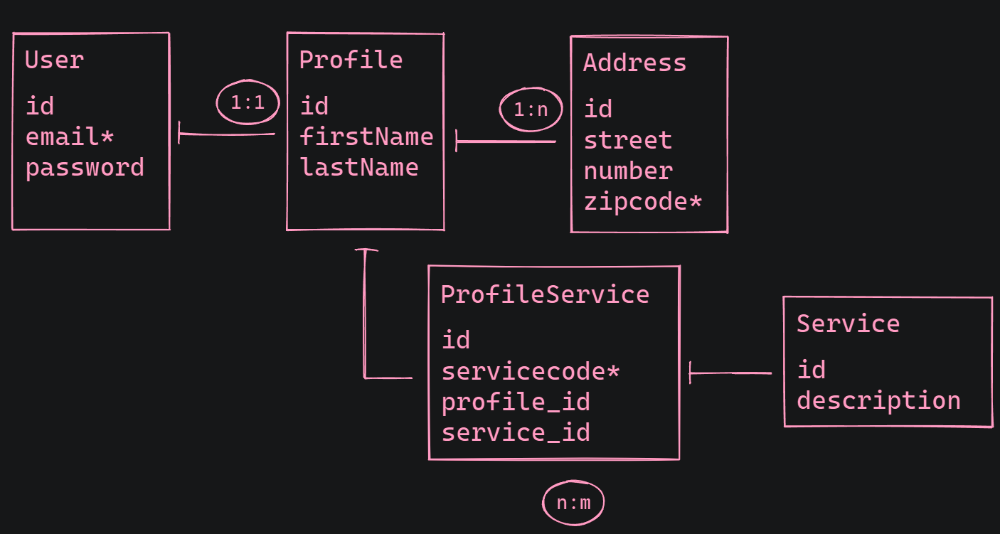

# prisma-07: ## Relacionamentos são complexos

- Modelar um banco de dados nunca é uma tarefa fácil, no entanto, o Prisma também nos ajuda a fazer isso, principalmente no que diz respeito aos relacionamentos.
- Tudo o que aprendemos sobre relacionamentos nas aulas de SQL podem e devem ser aplicadas no Prisma.
- ➡️ Usando o `schema.prisma`, modele um esquema que suporte a estrutura definida na  seguinte figura (* = unique):
- Para testar o seu schema, você pode usar esse site: https://prismaliser.app/
    

